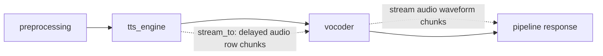

# MOSS-TTS Streaming Plan and E2E Acceptance

Date: 2026-06-02

Base branch: `main` after `git pull --ff-only origin main`

Base commit: `561f327`

Tracking issue: https://github.com/sgl-project/sglang-omni/issues/637

Dependency already merged: https://github.com/sgl-project/sglang-omni/pull/609

Working branch: `feat/moss_streaming`

## Goal

Implement the MOSS-TTS part of issue #637 for streaming AR row chunks and a
streaming vocoder. The change should be independently deliverable after #609
because the main MOSS Delay pipeline already exists and the shared pipeline
streaming infrastructure is already present.

The target behavior is:

- Non-streaming MOSS-TTS continues to run through the current
  `preprocessing -> tts_engine -> vocoder` path.
- Streaming requests receive audio chunks before the terminal response.
- The AR engine emits incremental delayed-code rows through the existing
  `OmniScheduler` stream hook.
- The vocoder consumes those rows through the existing streaming scheduler
  message path, incrementally removes the Delay pattern, and decodes audio
  chunks with persistent codec state.
- Batched vocoder execution is preserved where practical so high-concurrency
  streaming does not fall back to per-request serial decode.

## Baseline After #609

The implementation should be based on the MOSS files that are now present on
`main`:

- `sglang_omni/models/moss_tts/config.py`
  - Defines `MossTTSPipelineConfig`.
  - Current stage graph is `preprocessing -> tts_engine -> vocoder`.
  - No `stream_to` edge is configured yet.
- `sglang_omni/models/moss_tts/stages.py`
  - Defines `create_preprocessing_executor`.
  - Defines `create_sglang_tts_engine_executor`.
  - Defines `create_vocoder_executor`.
  - Current vocoder path is full-response decode only.
- `sglang_omni/models/moss_tts/model_runner.py`
  - `MossTTSModelRunner.post_process_outputs` appends one generated row per
    decode step to `sched_req.data.output_rows`.
  - This gives the streaming builder enough data to emit per-step AR chunks
    without modifying the model forward path.
- `sglang_omni/models/moss_tts/request_builders.py`
  - Defines `MossTTSSGLangRequestData`.
  - Defines `apply_sglang_moss_tts_result`, which builds final
    `state.delayed_audio_codes` from accumulated output rows.
- `sglang_omni/models/moss_tts/codec.py`
  - Provides the current full-output helpers, including
    `split_moss_audio_segments`.
- `sglang_omni/models/moss_tts/payload_types.py`
  - Defines the MOSS state serialized between stages.

The implementation should reuse existing pipeline streaming infrastructure:

- `sglang_omni/config/schema.py`
  - `StageConfig.stream_to` already supports stream edges.
  - `StageConfig.stream_done_to_fn` exists for custom done routing.
- `sglang_omni/scheduling/omni_scheduler.py`
  - `OmniScheduler(..., stream_output_builder=...)` can emit
    `OutgoingMessage(type="stream", ...)` after model-runner steps.
- `sglang_omni/scheduling/streaming_simple_scheduler.py`
  - Provides streaming-stage lifecycle hooks:
    `on_streaming_new_request`, `on_stream_chunk`, `on_stream_done`, and
    `clear_stream_state`.
- `sglang_omni/scheduling/messages.py`
  - Defines `IncomingMessage` and `OutgoingMessage`.
- `sglang_omni/pipeline/stage/runtime.py` and
  `sglang_omni/pipeline/relay_io.py`
  - Already route stream chunks and terminal stage payloads through the
    pipeline.

Useful reference implementations:

- `sglang_omni/models/higgs_tts/vocoder_scheduler.py`
  - Most relevant reference for delayed-code streaming vocoder behavior.
  - Uses overlap-window re-decode with stateless codec calls, not codec KV
    streaming state.
- `sglang_omni/models/fishaudio_s2_pro/streaming_vocoder.py`
  - Relevant reference for streaming vocoder state, chunking, and output
    messages.
  - Also uses retained overlap tokens plus repeated decode rather than a
    persistent codec slot manager.
- `sglang_omni/models/qwen3_omni/request_builders.py`
  - Relevant reference for building `stream_output_builder` callbacks.
- `sglang_omni/models/qwen3_omni/bootstrap.py`
  - Relevant reference for wiring a model-specific stream builder into
    `OmniScheduler`.

## Scope

In scope:

- Add stream edge support for MOSS-TTS AR output rows.
- Add MOSS-specific stream-output builder.
- Add a streaming vocoder scheduler for MOSS-TTS.
- Add incremental Delay-pattern de-delay logic.
- Add persistent codec streaming-state management and final flush handling.
- Preserve the current non-streaming behavior.
- Add unit tests for chunk building, de-delay correctness, stream lifecycle, and
  abort cleanup.
- Add a gated end-to-end acceptance recipe for real model verification on
  H100/H200.

Out of scope:

- General cache work from other parts of issue #637.
- Torch compile work from other parts of issue #637.
- Changes to unrelated TTS models.
- A new public API shape unless the existing streaming request parameter is
  insufficient.

## Proposed Architecture



The terminal path remains unchanged for non-streaming requests. For streaming
requests, `tts_engine` additionally sends row chunks to `vocoder`; the vocoder
keeps per-request stream state and emits audio waveform chunks as soon as enough
stable frames are available.

## Implementation Plan

### 1. Pipeline Config Wiring

Modify `sglang_omni/models/moss_tts/config.py`.

Plan:

- Match the existing Higgs/Fish pattern:
  - set `stream_to=["vocoder"]` unconditionally on the `tts_engine` stage;
  - set `can_accept_stream_before_payload=True` on the `vocoder` stage.
- Do not add a separate `moss_tts_streaming.yaml` for v1.
- Do not try to enable or disable `stream_to` per request. `stream_to` is a
  static stage-graph edge resolved at config load time.
- Runtime opt-in remains request-based:
  `MossStreamingVocoderScheduler.is_streaming_payload(payload)` checks
  `payload.request.params["stream"]`.
- Non-streaming requests still go through the existing terminal payload full
  decode path. The unconditional `stream_done` signal sent by the static
  stream edge is discarded by the non-streaming path.

Acceptance:

- `MossTTSPipelineConfig` validates under the existing schema.
- `tts_engine` has `stream_to=["vocoder"]`.
- `vocoder` has `can_accept_stream_before_payload=True`.
- Non-streaming requests still produce the same terminal audio behavior.
- Streaming requests route row chunks from `tts_engine` to `vocoder`.

### 2. MOSS AR Stream Chunk Builder

Modify `sglang_omni/models/moss_tts/request_builders.py` and
`sglang_omni/models/moss_tts/stages.py`.

Plan:

- Add `make_moss_tts_stream_output_builder`.
- Wire it into `OmniScheduler` inside `create_sglang_tts_engine_executor` via
  `stream_output_builder=...`.
- Emit at most the newly generated row for each decode step.
- Track `streamed_row_count` on `MossTTSSGLangRequestData` to avoid duplicate
  row emission because `output_rows` is cumulative.
- Emit only for requests whose `StagePayload.request.params["stream"]` is true.
- Skip emission when no new row exists, when the step is EOS-only, or when the
  scheduler asks `_emit_stream_output(..., skip_rids=...)` to suppress an
  overrun row.
- Stream payload should include enough metadata for the vocoder to decode
  without re-reading the full final result:
  - `row`: generated delayed row audio codes, without the leading text token.
  - `row_index`: zero-based generated row index.
  - `n_vq`: number of audio codebooks.
  - `audio_pad_code`.
  - `assistant_start_length`.
  - `sample_rate`.
  - `request_id`.
  - `modality="moss_delayed_audio_row"`.

Acceptance:

- Builder emits no chunks for non-streaming requests.
- Builder emits exactly one row per generated AR step for streaming requests.
- Final offline result from `apply_sglang_moss_tts_result` is unchanged.
- Unit test compares emitted row sequence with `data.output_rows`.

### 3. Incremental De-Delay State

Add `sglang_omni/models/moss_tts/streaming_vocoder.py`.

Plan:

- Implement a MOSS-specific stream state object, for example
  `_MossStreamingState`.
- Store:
  - accumulated delayed rows;
  - number of emitted complete frames;
  - `assistant_start_length`;
  - `audio_pad_code`;
  - `n_vq`;
  - global raw-frame index;
  - current segment index;
  - current segment frame offset;
  - emitted frames per segment;
  - retained overlap frames;
  - waveform chunk counters;
  - finalization state.
- Convert delayed rows into stable `[frames, n_vq]` audio-code frames
  incrementally.
- Reuse the same semantic rules as `split_moss_audio_segments` and the current
  full vocoder path:
  - remove the leading assistant prefix offset when needed;
  - wait until enough future rows exist for the Delay pattern;
  - filter full-pad separator frames;
  - do not emit duplicate frames;
  - preserve segment boundaries for pauses and special tokens.
- Treat segment boundaries as hard decode boundaries. A stream decode window
  must not cross a pad-only separator frame because the offline path decodes
  each segment independently and concatenates the resulting waveforms.
- Apply `assistant_start_length` using a global raw-frame index, and only to the
  first audio segment, matching `split_moss_audio_segments`.
- When a pad-only separator closes a segment, flush that segment, reset the
  segment-local overlap state, and start a fresh segment for subsequent frames.
- Add a unit test that feeds delayed rows one by one and verifies the
  concatenation of incremental frames matches the frames produced by the
  existing full-output codec helper.
- Include multi-segment tests with pause/silence separators, not only one
  continuous audio segment.

Acceptance:

- Incremental de-delay is byte-for-byte or tensor-equal with the current
  full-output de-delay path for representative generated rows.
- No frame is emitted twice.
- Final flush emits any remaining valid frames and drops padding-only frames.
- Multi-segment parity covers a prompt with at least one pause/silence separator
  and verifies that only the first segment is trimmed by `assistant_start_length`.

### 4. Streaming Vocode Scheduler

Add `MossStreamingVocoderScheduler` in
`sglang_omni/models/moss_tts/streaming_vocoder.py`.

Modify `sglang_omni/models/moss_tts/stages.py`.

Plan:

- Create `create_streaming_vocoder_executor`.
- Use `StreamingSimpleScheduler` as the base class.
- Keep `create_vocoder_executor` as the existing non-streaming full decode path,
  or have the streaming scheduler delegate non-streaming requests to the same
  full decode implementation.
- Implement:
  - `is_streaming_payload(payload)`;
  - `on_streaming_new_request(request_id, payload)`;
  - `on_stream_chunk(request_id, item)`;
  - `on_stream_done(request_id)`;
  - `clear_stream_state(request_id)`.
- For v1, decode streaming chunks per request, matching Higgs/Fish.
- Do not require streaming vocoder micro-batching for v1.
- Keep the existing `batch_compute_fn` behavior for non-streaming final payloads.
- Emit audio chunks as `OutgoingMessage(type="stream", ...)` with an
  `audio_waveform_payload` body and `metadata["modality"] = "audio"`.
- `stream_done` is triggered by the upstream stage runtime when `tts_engine`
  completes its terminal result and has `stream_to=["vocoder"]`. No
  `stream_done_to_fn` is required for the default v1 route.
- For streaming requests, the terminal `StagePayload` from
  `apply_sglang_moss_tts_result` still arrives at `vocoder` through `next`.
  It must be treated as the request lifecycle and metadata payload, not as a
  second full-decode input.
- In `on_streaming_new_request`, latch the terminal payload and usage metadata,
  but do not call the full `_vocode` path.
- In `on_stream_done`, final-flush the already accumulated stream rows, then
  emit the terminal payload expected by existing clients:
  - `sample_rate`;
  - `modality="audio"`;
  - `usage`;
  - final waveform payload, if the current API expects terminal audio.
- For non-streaming requests, `is_streaming_payload` returns false, so the
  terminal payload is decoded by the existing full vocoder path. Any earlier
  static-edge `stream_done` signal is ignored by `StreamingSimpleScheduler` when
  the payload is handled as non-streaming.

Acceptance:

- Streaming requests are kept out of the non-streaming batch path.
- Non-streaming requests still complete through full decode.
- Streaming terminal payloads are never decoded a second time by the full
  vocoder path.
- Stream chunk order is stable.
- `abort(request_id)` clears all per-request streaming state.
- `stream_done` after an already aborted request is ignored.

### 5. V1 Codec Strategy: Overlap-Window Re-Decode

Implement in `sglang_omni/models/moss_tts/streaming_vocoder.py`, with any small
shared helpers added to `sglang_omni/models/moss_tts/codec.py` if needed.

Plan:

- Load the processor with `_load_moss_processor` just like the current vocoder.
- Use only the codec API already exercised by the repository:
  `processor.decode_audio_codes([segment])`.
- Implement streaming audio chunks by retaining an overlap window of codec
  frames, re-decoding the current segment window, trimming previously emitted
  samples, and emitting only the delta.
- Keep the decode window inside a single segment. Segment separators flush and
  reset the segment-local overlap state.
- Track:
  - `stream_stride`;
  - `stream_followup_stride`;
  - `stream_overlap_tokens`;
  - `stream_holdback_tokens`;
  - optional `stream_crossfade_samples` if boundary smoothing is needed.
- Use no codec slot manager, no batch padding, and no `exec_mask` in v1.

Acceptance:

- The implementation works with only `processor.decode_audio_codes([segment])`.
- Fake-codec tests prove overlap trimming emits monotonic, non-duplicated audio
  deltas.
- Segment-boundary tests prove a decode window never crosses a pause/silence
  separator.
- Non-streaming final decode still uses the existing full decode path.

### 5b. Optional Future Codec Streaming Optimization

This is not part of the v1 acceptance criteria.

The OpenMOSS remote `trust_remote_code` implementation may expose APIs such as
`audio_tokenizer.streaming(batch_size=...)`, per-module `_streaming_state`, and
`exec_mask`. Those APIs are not referenced in this repository today and cannot
be verified from local source alone.

Only after a separate proof shows these APIs are stable for the target
checkpoint should a follow-up optimization consider:

- persistent codec slots;
- active-slot execution masks;
- batched streaming codec decode;
- per-slot reset on finish or abort.

Acceptance:

- Not applicable to v1.
- Any follow-up must include source verification, unit tests, and E2E proof
  before replacing the v1 overlap-window path.

### 6. Tests

Add focused tests before adding real-model acceptance.

Candidate files:

- `tests/unit_test/moss_tts/test_stream_output_builder.py`
  - Verifies one row per AR step and no duplicate stream chunks.
- `tests/unit_test/moss_tts/test_streaming_dedelay.py`
  - Verifies incremental de-delay against full de-delay, including
    multi-segment pause/silence separators.
- `tests/unit_test/moss_tts/test_streaming_vocoder_scheduler.py`
  - Uses a fake codec to verify lifecycle, chunk order, final flush, abort, and
    no double decode of the terminal payload.
- `tests/test_model/test_moss_tts_streaming_e2e.py`
  - Gated real-model test for H100/H200 or manually triggered CI.

Acceptance:

- Unit tests pass without downloading the real MOSS checkpoint.
- Gated E2E test is skipped unless model path and GPU markers are present.
- Tests cover both streaming and non-streaming request params.

### 7. Benchmark And Audit Artifacts

Add or extend a benchmark script.

Candidate files:

- `benchmarks/eval/benchmark_moss_tts_streaming.py`
- or extend an existing TTS benchmark if it already supports streaming output.

Required metrics:

- TTFA: time from request accepted to first audio chunk.
- Total latency.
- Real-time factor.
- Output duration.
- Number of emitted chunks.
- Average chunk duration.
- Streaming vocoder decode count and average decode latency.
- Streaming overlap settings.
- Average active vocoder batch size, report-only if an optional batching path is
  later implemented.
- Peak GPU memory.
- Abort cleanup success count.

Acceptance:

- Benchmark emits JSON with commit hash, model path, server args, GPU name, and
  all metrics listed above.
- Output includes per-concurrency summaries for 1, 4, 8, and 16 concurrent
  requests.

## Proposed File Changes

Expected implementation files:

- `sglang_omni/models/moss_tts/config.py`
  - Add unconditional `stream_to=["vocoder"]` to `tts_engine`.
  - Add `can_accept_stream_before_payload=True` to `vocoder`.
- `sglang_omni/models/moss_tts/stages.py`
  - Wire `stream_output_builder`.
  - Add `create_streaming_vocoder_executor`.
  - Keep existing full vocoder path compatible.
- `sglang_omni/models/moss_tts/request_builders.py`
  - Add `streamed_row_count` field.
  - Add `make_moss_tts_stream_output_builder`.
- `sglang_omni/models/moss_tts/streaming_vocoder.py`
  - New MOSS streaming vocoder scheduler, incremental de-delay state, and
    overlap-window re-decode logic.
- `sglang_omni/models/moss_tts/codec.py`
  - Optional shared helper for incremental de-delay if the logic should be
    tested independently from the scheduler.
- `tests/unit_test/moss_tts/test_stream_output_builder.py`
- `tests/unit_test/moss_tts/test_streaming_dedelay.py`
- `tests/unit_test/moss_tts/test_streaming_vocoder_scheduler.py`
- `tests/test_model/test_moss_tts_streaming_e2e.py`
- `benchmarks/eval/benchmark_moss_tts_streaming.py`

No expected changes:

- Shared scheduler API should not need to change for the first version.
- Other model families should not need to change.
- Existing MOSS non-streaming request and response schema should remain
  compatible.

## E2E Acceptance Document

This section defines what must be proven before the implementation is accepted.

### Environment

Record the following for every E2E run:

- Git commit.
- Branch name.
- Model path, for example `OpenMOSS-Team/MOSS-TTS-v1.5`.
- GPU type and count.
- CUDA version.
- PyTorch version.
- `sglang` and `sglang_omni` versions or commit hashes.
- Full server command.
- Full benchmark command.
- Request dataset name and text prompts.

Recommended server command shape:

```bash
sgl-omni serve \
  --model-path OpenMOSS-Team/MOSS-TTS-v1.5 \
  --port 8010
```

The exact command can change with the final serve interface, but the audit
artifact must contain the real command and config used.

### Functional Acceptance

FA-001: Non-streaming compatibility

- Send a normal non-streaming MOSS-TTS request.
- Response contains terminal audio with `sample_rate=24000` unless checkpoint
  config states otherwise.
- Existing non-streaming path does not emit stream chunks.
- Output is non-empty and playable.

FA-002: Streaming first chunk

- Send the same request with `stream=true`.
- At least one audio stream chunk is received before the terminal response.
- First chunk is non-empty.
- Every chunk includes sample rate and audio payload metadata.

FA-003: Terminal response

- Streaming request still receives a terminal response.
- Terminal response includes usage fields when the AR engine generated usage.
- No delayed-code internals are exposed in the final user-facing response unless
  explicitly requested for debug.
- The terminal `StagePayload` carrying full `delayed_audio_codes` is not decoded
  again by the full vocoder path when `stream=true`.
- `stream_done` is the flush trigger for streaming requests; the terminal
  payload is used to latch request metadata and usage.

FA-004: Chunk ordering and concatenation

- Concatenate audio chunks in received order.
- Concatenated audio duration is within 2 percent of the non-streaming output
  duration for the same prompt and seed.
- No chunk has NaN, Inf, or zero samples.
- Chunk boundaries must not cross MOSS segment boundaries introduced by
  pad-only separator frames.

FA-005: Prompt coverage

Run the following prompt classes:

- short plain text;
- long text at least 300 Chinese or English characters;
- request with reference audio or voice-cloning input supported by current MOSS
  preprocessing;
- request with pauses or silence markers if supported by the existing MOSS
  prompt format;
- a multi-segment case that produces at least one pad-only separator frame;
- request with explicit seed for deterministic comparison.

FA-006: Concurrency

- Run streaming concurrency 1, 4, 8, and 16.
- All requests complete without deadlock.
- Chunk order is correct per request.
- Terminal responses are matched to the right request ids.

FA-007: Abort

- Start at least 10 streaming requests.
- Abort them after receiving the first or second chunk.
- No terminal audio is emitted after abort.
- Per-request stream state and retained overlap buffers are released.
- Subsequent requests complete normally.

### Quality Acceptance

QA-001: Full-vs-stream parity

- For a fixed seed, compare non-streaming full decode and concatenated streaming
  chunks.
- Duration difference must be less than or equal to 2 percent.
- RMS volume difference should be reported.
- A manual listening sample set of at least 10 outputs should be attached.
- At least one parity sample must be multi-segment and include a pause/silence
  separator.

QA-002: Boundary quality

- Report boundary discontinuity at chunk joins.
- Join discontinuity should be no worse than the implementation's chosen
  threshold or baseline window. If a crossfade is used, include crossfade
  length and before/after measurements.

QA-003: No empty or malformed chunks

- No chunk may contain zero samples.
- No chunk may contain NaN or Inf.
- No chunk may be emitted after the request is terminal or aborted.

### Performance Acceptance

PA-001: TTFA

- Report P50 and P95 TTFA at concurrency 1, 4, 8, and 16.
- First audio should arrive before the terminal response for every successful
  streaming request.
- The report must identify how many AR rows are buffered before first audio,
  because MOSS Delay requires alignment buffering before a full frame is stable.

PA-002: Throughput

- Report QPS and real-time factor for streaming and non-streaming runs.
- Streaming throughput should be at least 90 percent of non-streaming throughput
  at the same concurrency, unless the report explains a measured bottleneck.

PA-003: Streaming vocoder decode report

- For v1, streaming vocoder decode is per request and uses overlap-window
  re-decode. This is report-only, not a pass/fail batching gate.
- Report per-request decode count, average decode latency, overlap tokens,
  holdback tokens, and emitted chunk count.
- If a future optional batching path is implemented, report average active
  vocoder batch size, but do not require `> 1.5` for v1.

PA-004: Memory

- Report peak GPU memory.
- Streaming peak GPU memory should not exceed non-streaming peak by more than
  10 percent at the same concurrency, unless the report explains why.

### Stability Acceptance

SA-001: Soak test

- Run at least 200 streaming requests or a 30-minute streaming soak, whichever
  is easier in the target environment.
- No request hangs.
- No unhandled scheduler exceptions.
- No monotonic GPU memory growth above 1 GB after warmup.

SA-002: Cleanup

- After all requests complete or abort, active stream state count is zero.
- Retained overlap buffers are released.
- Pending stream queues are empty.

## Audit Artifacts Required

Attach or save the following:

- Implementation PR commit hash.
- This plan document.
- Server command and full config.
- Unit test output.
- Gated E2E command and output.
- Benchmark JSON for concurrency 1, 4, 8, and 16.
- Generated WAV files for at least 10 streaming outputs.
- Matching non-streaming WAV files for those same prompts and seeds.
- GPU memory summary.
- Any profiler trace used to diagnose TTFA or vocoder batching.

## Risks And Mitigations

Risk: Delay-pattern alignment may require more buffering than expected.

Mitigation:

- First implement tensor-level incremental de-delay parity tests against the
  current full vocoder helper.
- Do not tune chunk size until parity is proven.

Risk: OpenMOSS codec streaming state APIs are private or checkpoint-specific.

Mitigation:

- Do not use these APIs in the v1 main path.
- Use the repository-known `processor.decode_audio_codes([segment])` API with
  overlap-window re-decode.
- Treat codec streaming state as a follow-up optimization only after source and
  E2E verification.

Risk: Per-request streaming vocoder decode can reduce high-concurrency
throughput.

Mitigation:

- Match Higgs/Fish for v1 to keep correctness risk low.
- Tune `stream_stride`, `stream_followup_stride`, and overlap settings before
  adding unverified codec streaming complexity.
- Report throughput and decode latency; do not make active streaming batch size
  a v1 acceptance gate.

Risk: Static `stream_to` sends `stream_done` for non-streaming requests too.

Mitigation:

- Set `can_accept_stream_before_payload=True` on `vocoder`, matching Higgs/Fish.
- Use `is_streaming_payload` to keep non-streaming payloads on the full decode
  path.
- Rely on `StreamingSimpleScheduler` to discard pending stream-done state when
  the request is handled as non-streaming.

Risk: Streaming terminal payload is decoded twice.

Mitigation:

- For `stream=true`, `on_streaming_new_request` latches the terminal payload but
  does not call the full vocoder compute function.
- `on_stream_done` flushes the rows accumulated from stream chunks and emits the
  final result.
- Add a scheduler unit test that verifies terminal `delayed_audio_codes` are not
  passed to the full decode function for streaming requests.

Risk: Final stream flush may duplicate or drop frames.

Mitigation:

- Track emitted frame count in `_MossStreamingState`.
- Add tests for short prompts, exact chunk-boundary prompts, and prompts ending
  with padding or silence.
- Add multi-segment tests where a pad-only separator lands near a chunk boundary.

Risk: Other issue #637 work is not completed.

Mitigation:

- Keep this PR scoped to MOSS streaming and the already-merged #609 files.
- Do not require cache or torch-compile work.
- Preserve existing non-streaming behavior so this part can be merged
  independently.
